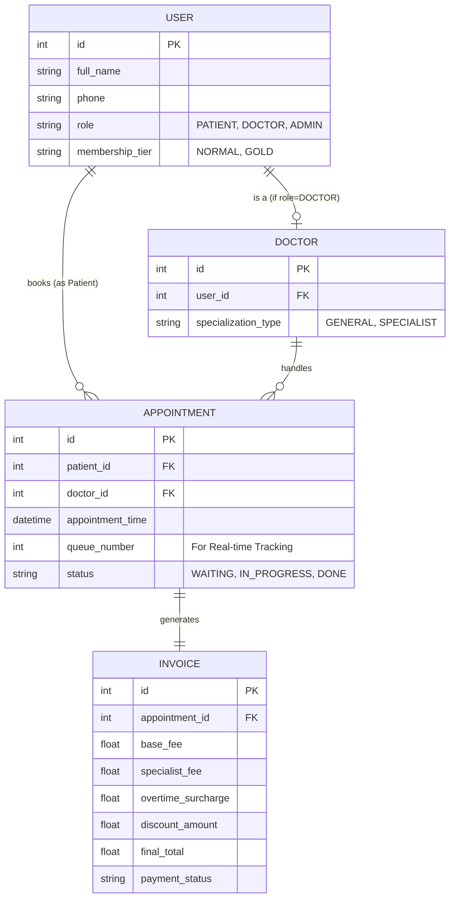

# Phần 3: Phân tích và thiết kế hệ thống với AI - Báo cáo nộp bài

## 1. Mục tiêu kỹ thuật (Tech Stack & Kiến trúc)
**Yêu cầu:** Đề xuất Giải pháp Công nghệ (Nhiệm vụ 1) cho hệ thống Rikkei Care với các yêu cầu tính phí linh hoạt và tracking số thứ tự Real-time.

**Giải pháp đề xuất:**
- **Backend:** Java Spring Boot (Đồng bộ với hệ sinh thái hiện tại, xử lý tốt transaction tài chính/y tế).
- **Database chính:** PostgreSQL (Đảm bảo tính ACID cho dữ liệu thanh toán và hóa đơn).
- **Công nghệ Real-time & Caching:** Redis kết hợp với WebSocket. 
  - *Lý do cho khách hàng:* Thay vì bắt ứng dụng điện thoại của bệnh nhân phải "hỏi" server liên tục xem "Đến lượt tôi chưa?" (gây quá tải), WebSocket sẽ tạo một kết nối mở để tự động "báo" cho điện thoại ngay khi số thứ tự thay đổi. Redis sẽ đóng vai trò ghi nhớ số thứ tự này trên RAM để truy xuất siêu tốc. Giải pháp này giúp hệ thống chịu tải hàng ngàn bệnh nhân cùng lúc mà không bị sập.

## 2. Lịch sử Prompt (Prompt Chain)
Toàn bộ các câu lệnh đã nhập vào AI để giải quyết lần lượt 3 nhiệm vụ:

- **Prompt 1 (Nhiệm vụ 1 - Tech Stack):** *"Tôi đang thiết kế hệ thống Rikkei Care (Java Spring Boot) với yêu cầu: 3 roles (Bệnh nhân, Bác sĩ, Admin), tính phí linh hoạt và tính năng Tracking số thứ tự gọi khám Real-time trên mobile app. Hãy đề xuất Tech Stack (Database, Real-time công nghệ) phù hợp và giải thích lý do thuyết phục."*
- **Prompt 2 (Nhiệm vụ 2 - Bóc tách Entity):** *"Dựa trên Stack đó và các nghiệp vụ: khám tổng quát/chuyên khoa, phụ phí ngoài giờ, thành viên hạng Vàng. Hãy bóc tách cho tôi các thực thể (Entities) cốt lõi của Database."*
- **Prompt 3 (Khắc phục lỗi AI):** *"Bạn gom Bác sĩ và Bệnh nhân chung vào 1 bảng `User` là đúng, nhưng Bác sĩ còn có chuyên khoa (Tổng quát/Chuyên khoa) mà Bệnh nhân không có. Việc nhét trường `specialization` vào `User` sẽ làm rác dữ liệu. Hãy tách `Doctor` thành một bảng riêng liên kết 1-1 với `User`. Đồng thời bổ sung trường `queue_number` vào `Appointment`."*
- **Prompt 4 (Nhiệm vụ 3 - ERD):** *"Từ các thực thể đã chốt (User, Doctor, Appointment, Invoice), hãy viết mã code Mermaid để vẽ sơ đồ ERD."*

## 3. Phân tích lỗi AI (Nhận xét phản biện)
- **Điểm AI làm sai/chưa tối ưu:** Khi phản hồi **Prompt 2**, AI mắc lỗi cơ bản trong việc chuẩn hóa cơ sở dữ liệu. AI tạo một bảng `User` duy nhất để chứa cả Admin, Bác sĩ và Bệnh nhân, và nhét luôn trường `specialization_type` (chuyên khoa) vào đó. Hệ quả: Bệnh nhân không có chuyên khoa nên dữ liệu sẽ bị Null, gây lãng phí bộ nhớ và vi phạm chuẩn thiết kế. Hơn nữa, AI quên thiết kế trường `queue_number` trong bảng `Appointment` vốn rất cần cho Real-time Tracking.
- **Cách sinh viên khắc phục:** Tôi đã sử dụng **Prompt 3** để yêu cầu AI cấu trúc lại DB: tách `Doctor` thành một bảng riêng (có FK nối tới User) để lưu chuyên môn, và thêm `queue_number` vào hàng đợi. Tôi hoàn toàn **không đồng ý** với thiết kế ban đầu của AI vì nó thiếu tư duy mở rộng cho hệ thống dữ liệu y tế.

---

## 4. Kết quả thực thi các Nhiệm vụ

### A. Danh sách Entities (Nhiệm vụ 2)
Sau khi đã được tinh chỉnh, danh sách các thực thể cốt lõi bao gồm:
1. **User:** `id` (PK), `full_name`, `phone`, `role` (PATIENT, DOCTOR, ADMIN), `membership_tier` (NORMAL, GOLD).
2. **Doctor:** `id` (PK), `user_id` (FK tới User), `specialization_type` (GENERAL, SPECIALIST).
3. **Appointment:** `id` (PK), `patient_id` (FK), `doctor_id` (FK), `appointment_time`, `queue_number` (dành cho Real-time tracking), `status`.
4. **Invoice:** `id` (PK), `appointment_id` (FK), `base_fee`, `specialist_fee`, `overtime_surcharge`, `discount_amount`, `final_total`, `payment_status`.

### B. Mã vẽ sơ đồ ERD (Nhiệm vụ 3)
Đoạn mã định dạng Mermaid dùng để render sơ đồ quan hệ:

